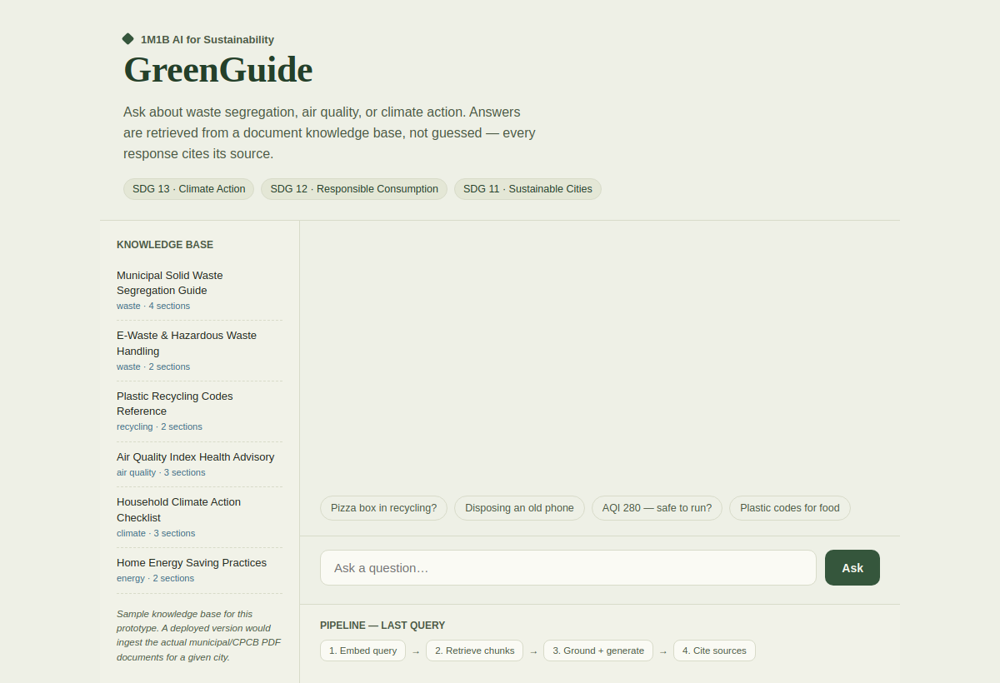

<h1 align="center">🌱 GreenGuide AI</h1>

<p align="center">
  <strong>A retrieval-grounded AI assistant for local waste segregation, air quality advisory, and climate-action guidance</strong>
</p>

<p align="center">
  <i>Built for the <b>1M1B AI for Sustainability Virtual Internship</b> in collaboration with <b>IBM SkillsBuild</b> & <b>AICTE</b></i>
</p>

<p align="center">
  
  
  
  
</p>

---

## 📌 Author & Affiliation

* **Author:** Aryan
* **Institution:** Panipat Institute of Engineering & Technology
* **Program:** 1M1B AI for Sustainability Virtual Internship (IBM SkillsBuild & AICTE)

---

## 🖼️ Prototype Screenshot

<p align="center">
  
</p>

---

## 🎯 SDG Alignment

| SDG Badge | Focus Area | Description |
| :--- | :--- | :--- |
| 🟢 **SDG 13** | **Climate Action** *(Primary)* | Direct action via household climate checklists and energy savings guidance. |
| 🟡 **SDG 12** | **Responsible Consumption & Production** | Actionable local waste segregation, plastic code references, and e-waste handling. |
| 🔵 **SDG 11** | **Sustainable Cities & Communities** | Real-time AQI advisories and municipal waste management support for residents. |

---

## 💡 Problem Statement

> *How might we use AI to make local climate, waste, and sustainability information accessible and actionable, so that residents and students can make informed daily decisions and reduce their environmental impact?*

Municipal waste rules, AQI advisories, and climate guidance exist — but they are scattered across dense PDFs and government sites that aren't written for someone trying to make a quick decision. A static FAQ can't handle a specific question like *"Can I recycle a greasy pizza box?"*. 

**GreenGuide** answers free-form questions using **Retrieval-Augmented Generation (RAG)**, grounded strictly in a real knowledge base, with every answer citing its exact source document.

---

## ⚙️ How It Works (RAG Pipeline Flow)

```
       ┌────────────────────────┐
       │   User Query Input     │
       └───────────┬────────────┘
                   │
                   ▼
       ┌────────────────────────┐
       │ 1. Query Tokenization  │
       └───────────┬────────────┘
                   │
                   ▼
       ┌────────────────────────────────────────────────────────┐
       │ 2. Keyword-Scored Retrieval Over Knowledge Base        │
       │    └─► Extracts Top 3 Most Relevant Chunks             │
       └───────────┬────────────────────────────────────────────┘
                   │
                   ▼
       ┌────────────────────────────────────────────────────────┐
       │ 3. Context-Bound LLM Generation                        │
       │    └─► Model restricted from using outside knowledge   │
       └───────────┬────────────────────────────────────────────┘
                   │
                   ▼
       ┌────────────────────────────────────────────────────────┐
       │ 4. Grounded Output & Inline Source Citations           │
       └───────────┬────────────────────────────────────────────┘
```

> [!NOTE]
> **Strict Fallback Guarantee:** If no knowledge base chunk matches the user query sufficiently, the assistant explicitly states it does not know — preventing hallucinations and unverified guesses.

---

## 📂 Repository Structure

```text
greenguide-ai/
├── 📄 README.md                        # Comprehensive project documentation
├── 🌐 prototype/
│   └── greenguide.html                # Working single-file RAG chatbot (open in browser)
├── 📊 deck/
│   └── GreenGuide_Project_Deck.pptx   # Final submission deck (SDG alignment, pipeline, impact)
├── 🛠️ build/
│   └── build_deck.js                  # pptxgenjs script used to generate presentation deck
└── 🖼️ assets/
    └── prototype_screenshot.png       # Real UI screenshot of running prototype
```

---

## 🚀 Running the Prototype

No build step, node modules, or server setup required — it runs as a single self-contained application!

1. Open `prototype/greenguide.html` directly in any modern web browser.
2. Ask any free-form question or click one of the suggested question chips.
3. **Execution:** 
   - The **Retrieval Step** runs client-side (keyword scoring over embedded knowledge base chunks).
   - The **Generation Step** produces a grounded, cited answer based strictly on retrieved chunks.

---

## 📚 Knowledge Base Coverage

The prototype ships with a curated sample knowledge base covering:

- 🗑️ **Municipal Solid Waste Segregation Guide**
- 🔋 **E-Waste & Hazardous Waste Handling**
- ♻️ **Plastic Recycling Codes Reference**
- 🌫️ **Air Quality Index (AQI) Health Advisory**
- 📋 **Household Climate Action Checklist**
- ⚡ **Home Energy Saving Practices**

> [!TIP]
> **Production Scalability:** The current content represents demo data. A live deployment can instantly ingest actual municipal or CPCB PDF documents for any target city without changing the underlying pipeline.

---

## 🛡️ Responsible AI Considerations

* **⚖️ Fairness:** Sourced from official government and municipal content standards rather than unverified opinion to prevent regional bias.
* **🔍 Transparency:** Every generated response includes inline source citations referencing the exact document chunk used.
* **🛡️ Ethics & Safety:** Declines to answer when questions fall outside the knowledge base scope instead of generating plausible-sounding guesses.
* **🔒 Privacy:** 100% private. No user account, tracking, or personal data collection is required.

---

## 🌟 Expected Impact

* **Residents:** Receive instant, source-backed answers for daily eco-decisions instead of guessing.
* **Municipalities:** Reduce recycling contamination through easy-to-follow waste segregation guidance.
* **Health & Community:** Protect sensitive groups with accessible, actionable real-time AQI guidance.
* **Scalable Infrastructure:** Easily localized by swapping knowledge base PDF documents without altering the core pipeline.

---

<p align="center">
  <i>Built with ❤️ for the <b>1M1B AI for Sustainability Virtual Internship</b> in collaboration with <b>IBM SkillsBuild</b> & <b>AICTE</b>.</i>
</p>

